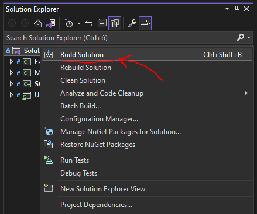

# Initial setup

## Clone
Make sure you have enough free disk space.
Building SQLInjectionAnalyzer involves downloading many packages. The recommendation is to dedicate at least 500 MB of free disk space for the repository.
#### HTTPS
```
git clone https://github.com/KleinMichalGit/SQLInjectionAnalyzer.git
```
#### SSH
```
git clone git@github.com:KleinMichalGit/SQLInjectionAnalyzer.git
```
#### GitHub CLI
```
gh repo clone KleinMichalGit/SQLInjectionAnalyzer
```
## Build prerequisites
#### Visual Studio 2019, version 16.8.3 or higher
Make sure you have Visual Studio 2019, version 16.8.3 or higher installed on your machine.

## One click/line build


Run either `Build Solution` in your Visual Studio, or
```
dotnet build
```
in command line.