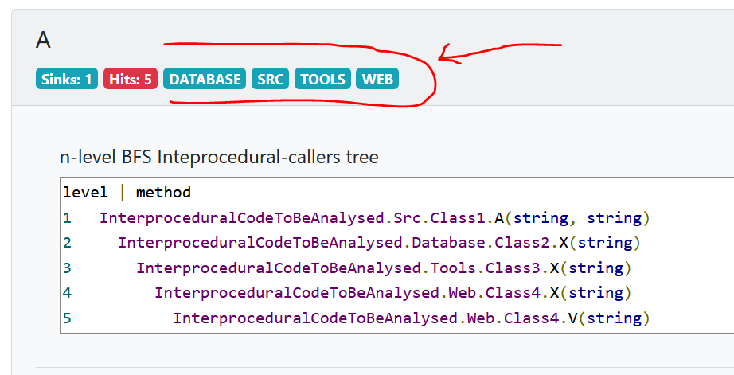

# Source areas

## What are source areas
A `source area` is a batch with an informative character in a final `.html` report. It describes
a path taken during investigation of the source of the callers of a vulnerable method.
For example, if `at least 1` caller (recursively at least 1 caller of the caller, etc.) is located
in a file which is stored under a folder `my/folder/WEB/`, then `an informative batch` with text `WEB` will be placed 
under the name of the vulnerable method. It helps to filter the final results quickly.
`Source areas` are adjustable in a `config.json` file. You can set your own paths and labels of these paths.

## Exemplary usage in `config.json`
Consider the following config.json (namely the sourceAreas):
```json
{
    "level": 3,
    "sourceAreas": [
        {
            "label": "WEB",
            "path": "InterproceduralCodeToBeAnalysed\\Web\\"
        },
        {
            "label": "DATABASE",
            "path": "InterproceduralCodeToBeAnalysed\\Database\\"
        },
        {
            "label": "SRC",
            "path": "InterproceduralCodeToBeAnalysed\\Src\\"
        },
        {
            "label": "TOOLS",
            "path": "InterproceduralCodeToBeAnalysed\\Tools\\"
        }
    ],
    "sinkMethods": [
        "SinkMethod1"
    ],
    "cleaningMethods": []
}
```
## How it looks like in `.html` report
The `.html` report should contain these informative batches to display the areas met during the interprocedural analysis.

