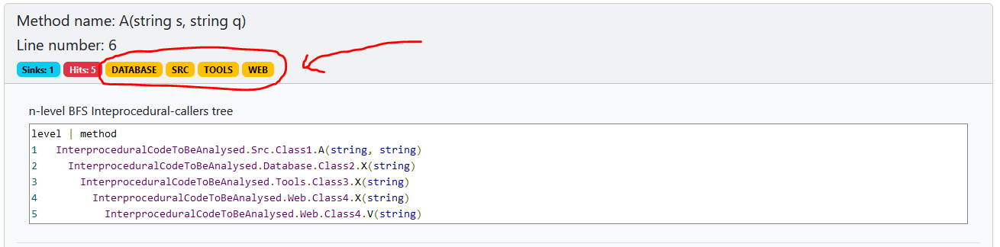

## Source areas
Consider the following config.json (namely the sourceAreas):
```json
{
    "level": 5,
    "sourceAreas": [
        {
            "label": "WEB",
            "path": "InterproceduralCodeToBeAnalysed\\Web\\"
        },
        {
            "label": "DATABASE",
            "path": "InterproceduralCodeToBeAnalysed\\Database\\"
        },
        {
            "label": "SRC",
            "path": "InterproceduralCodeToBeAnalysed\\Src\\"
        },
        {
            "label": "TOOLS",
            "path": "InterproceduralCodeToBeAnalysed\\Tools\\"
        }
    ],
    "sinkMethods": [
        "SinkMethod"
    ],
    "cleaningMethods": []
}
```
If the code structure looks like the following tree:
 


Then, the .html result should contain these informative batches to display the areas met during the interprocedural analysis.

