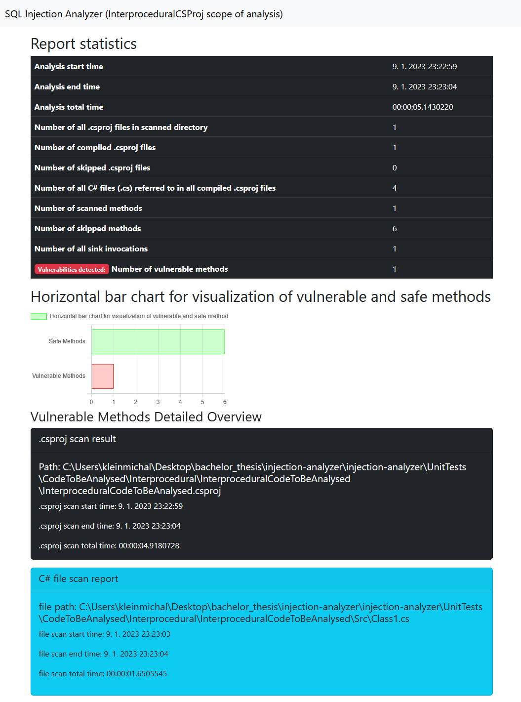
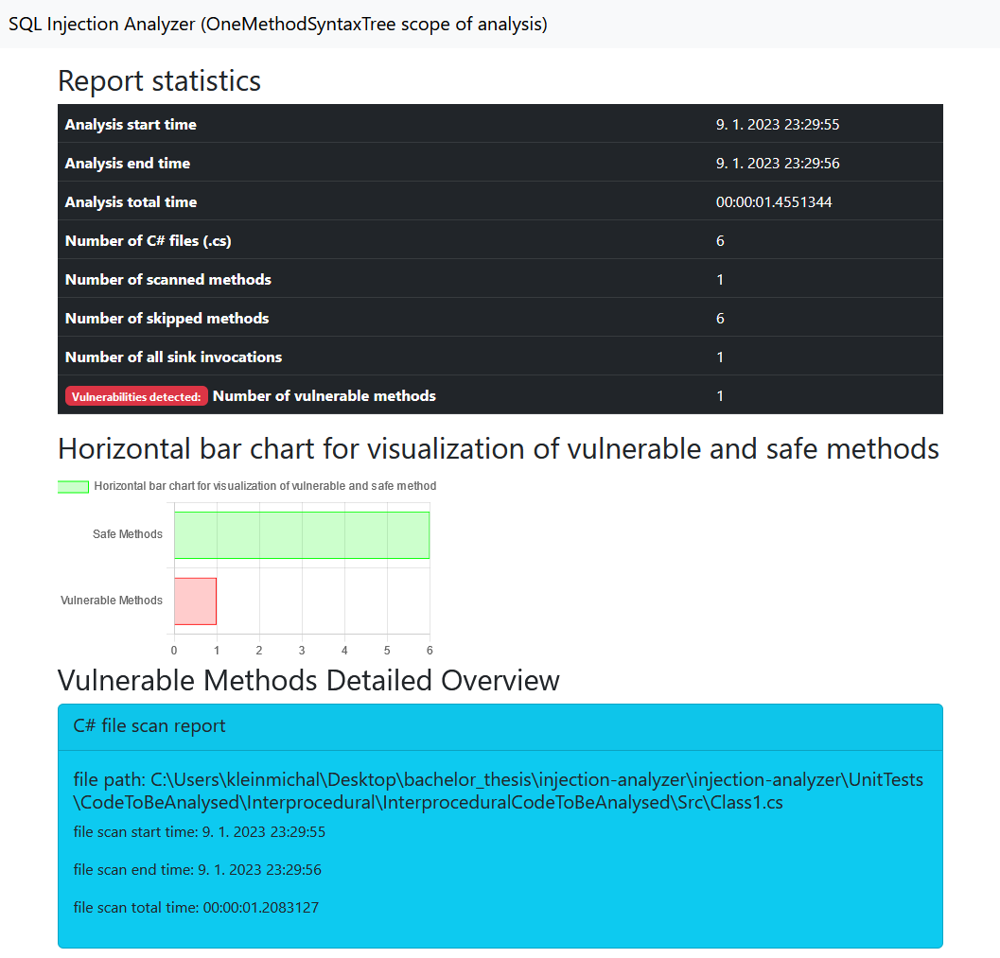
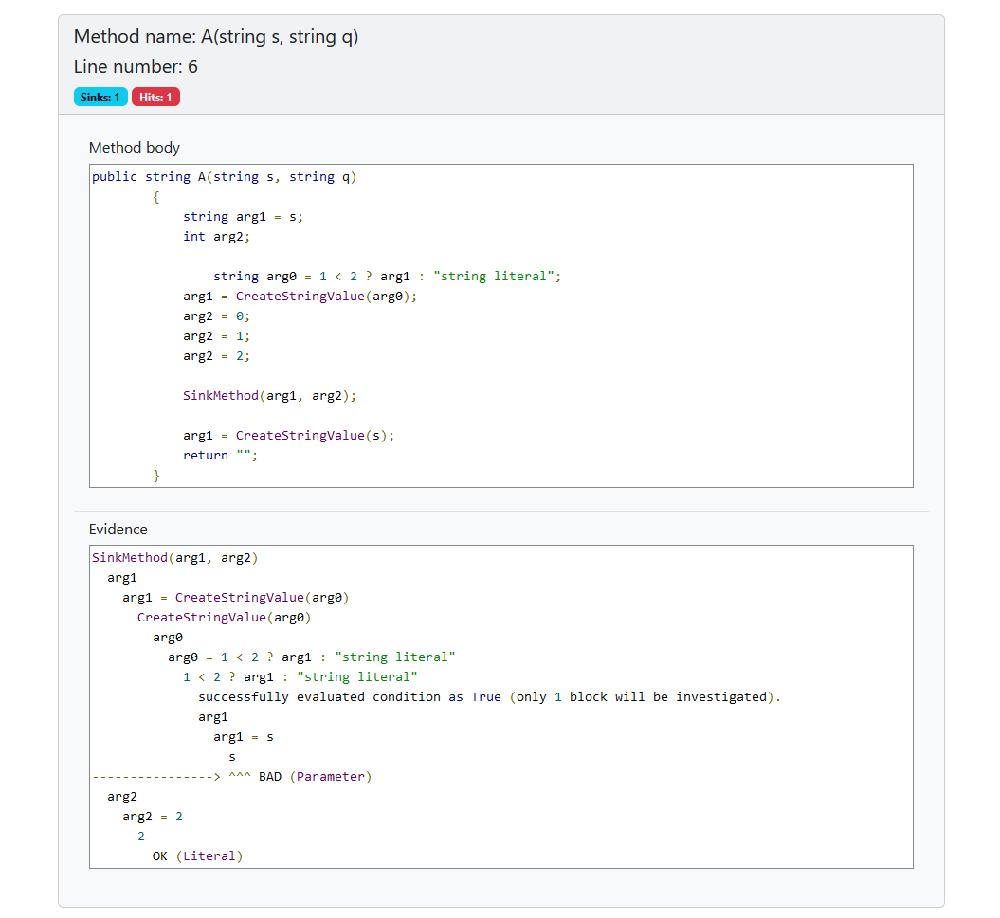

# Output Service

Generated results are adjustable by differentiating which result template to use according to the Scope of the analysis.

## For example
### Interprocedural Scope
Interprocedural scope contains namely n-level BFS trees for each vulnerable method. Also, evidence is interprocedural.

### Simple Scope
In comparison to the previous result, the Simple scope does not contain information about .csproj files nor BFS trees. Everything here is simplified.

