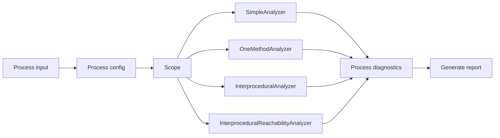

# SQL Injection Analyzer
## About
SQL Injection Analyzer is a Roslyn-based static source code analyzer which focuses on finding non parametric queries in C# source code.

## Interprocedural analysis

## Reachability

## Multiple scopes of analysis
## Usage manual
### Arguments
```
--path=VALUE                 (MANDATORY) path to the folder which should be analysed
--scope-of-analysis=VALUE    (MANDATORY) determines the scope of analysis
--config=VALUE               (MANDATORY) path to .json config file
--result=VALUE               (MANDATORY) path to the folder where diagnostic-result-files should be exported
--exclude-paths=VALUE        (OPTIONAL)  comma delimited list of sub-paths to be skipped during analysis
--write-console              (OPTIONAL)  write real-time diagnostic-results on console during analysis
--help                                   show this usage tutorial and exit
```
### Exemplary usage
```
.\SQLInjectionAnalyzer.exe --path=.\source\folder\ --scope-of-analysis=Interprocedural --config=.\config\folder\config.json --result=.\result\path\ --exclude-paths=TEST,E2E --write-console
```
### About arguments
```
--path:
     any valid path to the folder which should be analysed
--scope-of-analysis:
     Simple                         reads *.cs files separately, without compiling .csproj files, without performing interprocedural analysis, every block of code is considered as reachable (very fast but very imprecise)
     OneMethod                      compiles *.csproj files, without performing interprocedural analysis
     Interprocedural                compiles *.csproj files, performs n-level interprocedural analysis, every block of code is considered as reachable
     InterproceduralReachability    compiles *.csproj files, performs n-level interprocedural analysis, able to decide trivial problems when solving reachability problems (requires the most resources, the most precise type of analysis)
--config:
     any valid path to valid config.json (configures rules for taint propagation)
--result:
     any valid path to the folder where diagnostic-result-files should be exported
--exclude-paths:
     comma delimited list of sub-paths to be skipped during analysis (for example tests)
--write-console:
     informs about results in real-time
```
## Results
Analyzer should produce results in two formats into pre-defined directory (--result argument). 
### .html result
### .txt result

