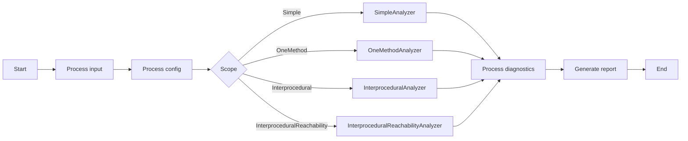

# SQL Injection Analyzer
## About
SQL Injection Analyzer is a Roslyn-based static source code analyzer which focuses on finding non parametric queries in C# source code.


## Flow chart


## Directory structure
- ExceptionHandler - custom exception types and exception writer used across entire repository
- Model - data models for diagnostics, taint propagation rules and input.
- SQLInjectionAnalyzer - main folder for analyzer platform, contains Program.cs with main method
- UnitTests - tests for all types of analyzers, config file reader and input reader.

## Usage manual
### Arguments
```
--path=VALUE                 (MANDATORY) path to the folder which should be analysed
--scope-of-analysis=VALUE    (MANDATORY) determines the scope of analysis
--config=VALUE               (MANDATORY) path to .json config file
--result=VALUE               (MANDATORY) path to the folder where diagnostic-result-files should be exported
--exclude-paths=VALUE        (OPTIONAL)  comma delimited list of sub-paths to be skipped during analysis
--write-console              (OPTIONAL)  write real-time diagnostic-results on console during analysis
--help                                   show this usage tutorial and exit
```
### Exemplary usage
```
.\SQLInjectionAnalyzer.exe --path=.\source\folder\ --scope-of-analysis=Interprocedural --config=.\config\folder\config.json --result=.\result\path\ --exclude-paths=TEST,E2E --write-console
```
### About arguments
```
--path:
     any valid path to the folder which should be analysed
--scope-of-analysis:
     Simple                         reads *.cs files separately, without compiling .csproj files, without performing interprocedural analysis, every block of code is considered as reachable (very fast but very imprecise)
     OneMethod                      compiles *.csproj files, without performing interprocedural analysis
     Interprocedural                compiles *.csproj files, performs n-level interprocedural analysis, every block of code is considered as reachable
     InterproceduralReachability    compiles *.csproj files, performs n-level interprocedural analysis, able to decide trivial problems when solving reachability problems (requires the most resources, the most precise type of analysis)
--config:
     any valid path to valid config.json (configures rules for taint propagation)
--result:
     any valid path to the folder where diagnostic-result-files should be exported
--exclude-paths:
     comma delimited list of sub-paths to be skipped during analysis (for example tests)
--write-console:
     informs about results in real-time
```
## Configuration
The file which specifies configuration rules for solving taint propagation problems is expected to have the following format.
It must be *.json file.
- level - maximal allowed height of BFS tree during Interprocedural analysis
- sourceAreas - batches for method findings which should be added to the .html result file. label defines the batch which should be added, path defines the path of the file containing at least one method analysed during analysis.
- sinkMethods - the names of the methods considered to be potentially dangerous when any not parametrised parameter is passed to them.
- cleaningMethods - the names of the methods considered to be clear. Therefore, if any tainted variable is passed to the calling of such method, it will automatically clean the tainted variable.
```json
{
  "level": 5,
  "sourceAreas": [
    {
      "label": "WEB",
      "path": "orion\\src\\web\\"
    },
    {
      "label": "DATABASE",
      "path": "orion\\src\\database\\"
    }
  ],
  "sinkMethods": [
    "ExecuteReader",
    "ExecuteDataSet",
    "ExecuteDataTable",
    "ExecuteExists",
    "ExecuteScalar",
    "ExecuteNonQuery"
  ],
  "cleaningMethods": [
    "CreateConnection",
    "SqlParameter",
    "String.Format"
  ]
}
```
## Results
Analyzer should produce .html, and .txt result into pre-defined directory (--result argument).

## Multiple scopes of analysis
TODO
## Interprocedural analysis
TODO
## Reachability
TODO

