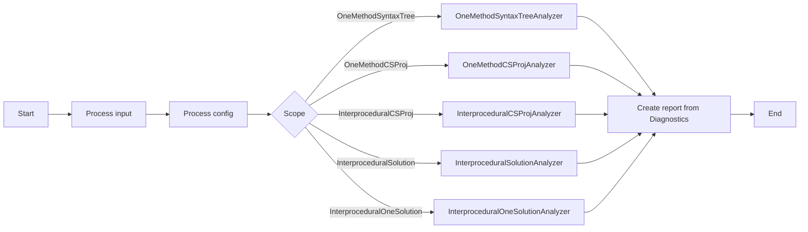

# SQL Injection Analyzer
## About
SQL Injection Analyzer is a [Roslyn](https://github.com/dotnet/roslyn "The .NET Compiler Platform")-based static source code analyzer which focuses on finding non parametric queries in C# source code.
It does so by tracking the origin of the arguments passed to the potentially vulnerable methods. There are multiple
ways and levels on which we can search for the source of the arguments. Therefore, [SQLInjectionAnalyzer](https://github.com/KleinMichalGit/SQLInjectionAnalyzer "SQL Injection Analyzer") provides the analysis
on the scope of a single file ([Syntax Tree](https://en.wikipedia.org/wiki/Abstract_syntax_tree "Abstract syntax tree")),
the scope of `.csproj`, and the scope of `.sln`.

## Contribution Guidelines
Dear open-source community, please read carefully the instructions before contributing to this repository [HERE](Documentation/README.md). 

## Motivation
Primarily, this project was created for the purpose of [my](https://github.com/KleinMichalGit "this is me :)") Bachelor's thesis.

## Directory structure
- [Documentation](Documentation/README.md) - please read carefully all documents inside the `Documentation` folder. It contains information about initial setup, naming conventions, programming style, etc...
- [Model](Model/README.md) - data models for diagnostics obtained during analysis, taint propagation rules and input.
- [SQLInjectionAnalyzer](SQLInjectionAnalyzer/README.md) - main folder for analyzer platform, contains `Program.cs` with `Main` method
- [UnitTests](UnitTests/README.md) - tests for all types of analyzers, config file reader and input reader.
- [ExceptionService](ExceptionService/README.md) - custom exception types and exception writer used across entire repository.
- [InputService](InputService/README.md) - methods for reading, validating, and processing input from console and from config files.
- [OutputService](OutputService/README.md) - multiple adjustable outputs based on the scope of the analysis.
- `RazorOutput` - .cshtml templates of final reports

## High level flow chart
Here is a diagrammatic representation of the entire process of the analysis from `Start` to `End`.



## Usage manual

### Exemplary usage
``` shell
.\SQLInjectionAnalyzer.exe --path=.\source\folder\ --scope-of-analysis=InterproceduralCSProj --config=.\config\folder\config.json --result=.\result\path\ --exclude-paths=TEST,E2E --write-console
```

### Arguments
```
--path=VALUE                 (MANDATORY) path to the folder which should be analysed
--scope-of-analysis=VALUE    (MANDATORY) determines the scope of analysis
--config=VALUE               (MANDATORY) path to .json config file
--result=VALUE               (MANDATORY) path to the folder where diagnostic-result-files should be exported
--exclude-paths=VALUE        (OPTIONAL)  comma delimited list of sub-paths to be skipped during analysis
--write-console              (OPTIONAL)  write real-time diagnostic-results on console during analysis
--help                                   show this usage tutorial and exit
```

### About arguments
```
--path:
     any valid path to the folder which should be analysed.
--scope-of-analysis:
     OneMethodSyntaxTree           Reads C# (*.cs) files separately and investigates Syntax Trees parsed from the separate C# files,
                                   without compiling .csproj files, without performing interprocedural analysis, every block of code is
                                   considered as reachable (very fast but very inacurate).
     OneMethodCSProj               Compiles *.csproj files, without performing interprocedural analysis. Every block of code is considered
                                   as reachable. Uses the same rules as OneMethodSyntaxTree, therefore provides the same results. This ScopeOfAnalysis
                                   serves only to investigate how much time is needed for compilation of all .csproj files.
     InterproceduralCSProj         Compiles all C# project (*.csproj) files, performs n-level interprocedural analysis (where number n is defined
                                   in config.json file) for each project separately, able to decide trivial problems when solving reachability problems.
     InterproceduralSolution       Opens all C# solution (*.sln) files, performs n-level interprocedural analysis (where number n is
                                   defined in config.json file) for each solution separately, able to decide trivial problems when solving
                                   reachability problems.
     InterproceduralOneSolution    Creates 1 universal C# solution (*.sln) by compiling all C# project files (*.csproj) and referrencing
                                   them in the solution, performs n-level interprocedural analysis (where number n is defined in config.json file)
                                   at 1 universaly created solution, able to decide trivial problems when solving reachability problems.
--config:
     any valid path to valid config.json (configures rules for taint variables propagation).
--result:
     any valid path to the folder where diagnostic-result-files should be exported.
--exclude-paths:
     comma delimited list of sub-paths to be skipped during analysis (for example tests).
--write-console:
     informs about results in real-time.
```
## Configuration
The file which specifies configuration rules for solving taint propagation problems is expected to have the following format.
It must be `*.json` file.
- level - maximal allowed height of BFS tree during `Interprocedural` analysis
- sourceAreas - batches for method findings which should be added to the `.html` result file. label defines the batch which should be added, path defines the path of the file containing at least one method analysed during analysis.
- sinkMethods - the names of the methods considered to be potentially dangerous when any non-parametrised parameter is passed to them.
- cleaningMethods - the names of the methods considered to be clear. Therefore, if any tainted variable is passed to the calling of such method, it will automatically clean the tainted variable.

#### Exemplary `config.json` file:
```json
{
  "level": 3,
  "sourceAreas": [
    {
      "label": "WEB",
      "path": "my\\path\\web\\"
    },
    {
      "label": "DATABASE",
      "path": "another\\path\\database\\"
    }
  ],
  "sinkMethods": [
    "NameOfTheSinkMethod1",
    "NameOfTheSinkMethod2",
    "NameOfTheSinkMethod3",
    "NameOfTheSinkMethod4",
    "NameOfTheSinkMethod5"
  ],
  "cleaningMethods": [
    "NameOfTheCleaningMethod1",
    "NameOfTheCleaningMethod2",
    "NameOfTheCleaningMethod3"
  ]
}
```

## Results
Analyzer should produce .html, and .txt result into pre-defined directory (--result argument). More
information about how result files are generated [HERE](OutputService/README.md).  
