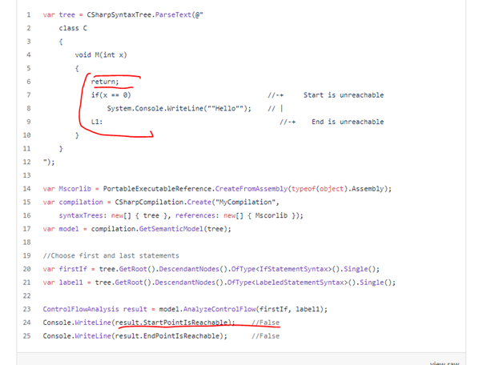

# Interprocedural Reachability Analyzer

## A brief description of philosophy
Compiles *.csproj files, performs n-level interprocedural analysis, performs reachability tests using
`SemanticModel`, `ControlFlowAnalysis`, `AnalyzeControlFlow` method.
(TODO)
## Example:
