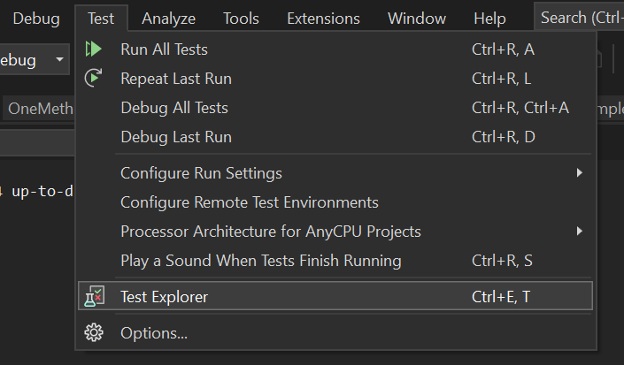
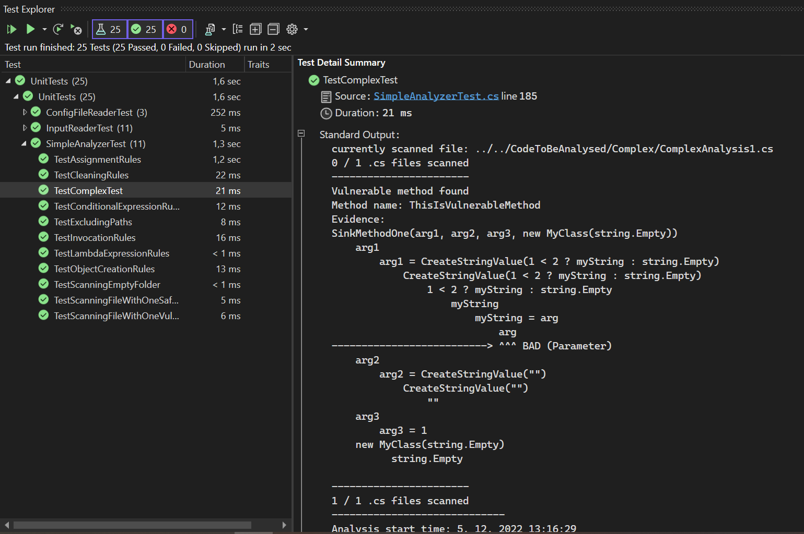

# Unit Tests
Unit tests for all types of analyzers, config file reader and input reader.
In this folder, there are also helpful tools for creating own unit tests.

## What are Unit Tests
"In computer programming, `unit testing` is a software testing method by 
which individual units of source code sets of one or more computer 
program modules together with associated control data, usage 
procedures, and operating procedures are tested to determine 
whether they are fit for use."[^1]
## How to add your own Unit Tests

### AnalyzerTestHelper.cs

#### Create scenario
### Config file examples
### Code to be analysed
### Expected diagnostics
### Taint propagation rules examples

## How to run the tests
#### Test Explorer
Please use Test Explorer in Visual Studio for running Unit Tests.

The good practice is to always attach the evidence/output of the test into Test Detail Summary.

## Directory structure
- `CodeToBeAnalysed/` - the code which serves as a source code which should be analysed during unit tests. Contains all examples and use cases covered by unit tests. Mainly every single taint propagation rule contains source code designed specifically to test the functionality of that rule. Contains both safe and vulnerable cases.  
- `ConfigFileExamples/` - valid and invalid config files tested by unit tests.
- `ExpectedDiagnostics/` - expected diagnostics of each tested analyzer. The results of unit tests are compared against these expected diagnostics. Tests are successful only if expected and received diagnostics are considered as equal. As diagnostics also contain various measured times, these times are not compared and should not be compared as it makes no logical sense comparing the times of two otherwise identical diagnostics (it depends on environment, etc..).   
- `TaintPropagationRulesExamples/` -  contains a creator of taint propagation rules used by unit tests.
- `AnalyzerTestHelper.cs` - contains helpful methods for creating test scenarios, and comparing diagnostic files. 
- `ConfigFileReaderTest.cs` - tests for config file reader.
- `SimpleAnalyzerTest.cs` - tests for simple analyzer.

[^1]: https://en.wikipedia.org/wiki/Unit_testing